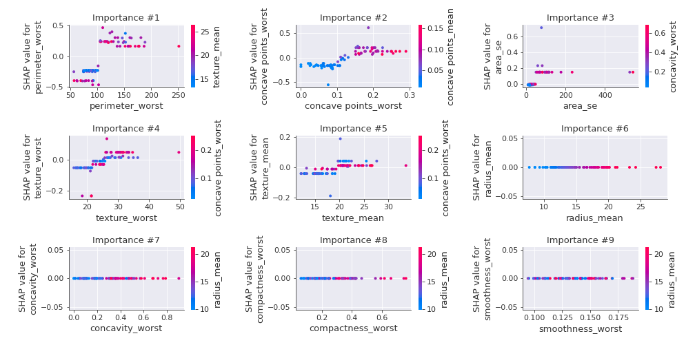

# Summary of 1_DecisionTree

[<< Go back](../README.md)

## Decision Tree
- **n_jobs**: -1
- **criterion**: gini
- **max_depth**: 3
- **explain_level**: 2

## Validation
 - **validation_type**: kfold
 - **k_folds**: 5
 - **shuffle**: True
 - **stratify**: True
 - **random_seed**: 1230

## Optimized metric
logloss

## Training time

69.1 seconds

## Metric details
|           |    score |   threshold |
|:----------|---------:|------------:|
| logloss   | 0.42201  |  nan        |
| auc       | 0.946378 |  nan        |
| f1        | 0.943396 |    0.50641  |
| accuracy  | 0.943396 |    0.50641  |
| precision | 0.962025 |    0.987654 |
| recall    | 0.981132 |    0        |
| mcc       | 0.886792 |    0.50641  |

## Confusion matrix (at threshold=0.50641)
|                     |   Predicted as negative |   Predicted as positive |
|:--------------------|------------------------:|------------------------:|
| Labeled as negative |                     200 |                      12 |
| Labeled as positive |                      12 |                     200 |

## Learning curves

## Decision Tree 

### Tree #1

### Rules

if (perimeter_worst <= 104.95) and (concave points_worst <= 0.135) and (smoothness_se > 0.003) then class: 0 (proba: 99.35%) | based on 153 samples

if (perimeter_worst > 104.95) and (concavity_worst > 0.218) and (concave points_mean > 0.044) then class: 1 (proba: 99.33%) | based on 150 samples

if (perimeter_worst > 104.95) and (concavity_worst > 0.218) and (concave points_mean <= 0.044) then class: 1 (proba: 58.33%) | based on 12 samples

if (perimeter_worst <= 104.95) and (concave points_worst > 0.135) and (texture_worst > 25.94) then class: 1 (proba: 100.0%) | based on 8 samples

if (perimeter_worst > 104.95) and (concavity_worst <= 0.218) and (texture_mean <= 21.26) then class: 0 (proba: 100.0%) | based on 7 samples

if (perimeter_worst <= 104.95) and (concave points_worst > 0.135) and (texture_worst <= 25.94) then class: 0 (proba: 100.0%) | based on 4 samples

if (perimeter_worst > 104.95) and (concavity_worst <= 0.218) and (texture_mean > 21.26) then class: 1 (proba: 100.0%) | based on 3 samples

if (perimeter_worst <= 104.95) and (concave points_worst <= 0.135) and (smoothness_se <= 0.003) then class: 0 (proba: 50.0%) | based on 2 samples

### Tree #2

### Rules

if (perimeter_worst <= 104.95) and (concave points_worst <= 0.135) and (area_se <= 48.975) then class: 0 (proba: 100.0%) | based on 153 samples

if (perimeter_worst > 104.95) and (concave points_worst > 0.109) and (texture_worst > 21.745) then class: 1 (proba: 99.3%) | based on 142 samples

if (perimeter_worst > 104.95) and (concave points_worst > 0.109) and (texture_worst <= 21.745) then class: 1 (proba: 71.43%) | based on 14 samples

if (perimeter_worst <= 104.95) and (concave points_worst > 0.135) and (texture_worst > 26.0) then class: 1 (proba: 100.0%) | based on 9 samples

if (perimeter_worst > 104.95) and (concave points_worst <= 0.109) and (texture_mean > 19.36) then class: 1 (proba: 85.71%) | based on 7 samples

if (perimeter_worst > 104.95) and (concave points_worst <= 0.109) and (texture_mean <= 19.36) then class: 0 (proba: 100.0%) | based on 7 samples

if (perimeter_worst <= 104.95) and (concave points_worst > 0.135) and (texture_worst <= 26.0) then class: 0 (proba: 80.0%) | based on 5 samples

if (perimeter_worst <= 104.95) and (concave points_worst <= 0.135) and (area_se > 48.975) then class: 1 (proba: 100.0%) | based on 2 samples

### Tree #3

### Rules

if (concave points_mean <= 0.051) and (radius_worst <= 16.83) and (area_se <= 48.7) then class: 0 (proba: 98.72%) | based on 156 samples

if (concave points_mean > 0.051) and (concavity_worst > 0.226) and (fractal_dimension_se <= 0.013) then class: 1 (proba: 99.35%) | based on 154 samples

if (concave points_mean <= 0.051) and (radius_worst > 16.83) and (texture_worst > 19.91) then class: 1 (proba: 84.62%) | based on 13 samples

if (concave points_mean > 0.051) and (concavity_worst <= 0.226) and (fractal_dimension_se > 0.003) then class: 0 (proba: 100.0%) | based on 7 samples

if (concave points_mean <= 0.051) and (radius_worst > 16.83) and (texture_worst <= 19.91) then class: 0 (proba: 100.0%) | based on 4 samples

if (concave points_mean > 0.051) and (concavity_worst <= 0.226) and (fractal_dimension_se <= 0.003) then class: 1 (proba: 100.0%) | based on 2 samples

if (concave points_mean <= 0.051) and (radius_worst <= 16.83) and (area_se > 48.7) then class: 1 (proba: 100.0%) | based on 2 samples

if (concave points_mean > 0.051) and (concavity_worst > 0.226) and (fractal_dimension_se > 0.013) then class: 0 (proba: 100.0%) | based on 1 samples

### Tree #4

### Rules

if (perimeter_worst > 102.2) and (concave points_worst > 0.107) and (smoothness_mean > 0.079) then class: 1 (proba: 97.53%) | based on 162 samples

if (perimeter_worst <= 102.2) and (concave points_worst <= 0.138) and (area_se <= 48.975) then class: 0 (proba: 99.35%) | based on 153 samples

if (perimeter_worst > 102.2) and (concave points_worst <= 0.107) and (symmetry_worst <= 0.266) then class: 0 (proba: 90.91%) | based on 11 samples

if (perimeter_worst <= 102.2) and (concave points_worst > 0.138) and (smoothness_se > 0.005) then class: 1 (proba: 100.0%) | based on 5 samples

if (perimeter_worst > 102.2) and (concave points_worst <= 0.107) and (symmetry_worst > 0.266) then class: 1 (proba: 100.0%) | based on 3 samples

if (perimeter_worst <= 102.2) and (concave points_worst <= 0.138) and (area_se > 48.975) then class: 1 (proba: 66.67%) | based on 3 samples

if (perimeter_worst > 102.2) and (concave points_worst > 0.107) and (smoothness_mean <= 0.079) then class: 0 (proba: 100.0%) | based on 1 samples

if (perimeter_worst <= 102.2) and (concave points_worst > 0.138) and (smoothness_se <= 0.005) then class: 0 (proba: 100.0%) | based on 1 samples

### Tree #5

### Rules

if (concave points_mean <= 0.051) and (area_worst <= 893.65) and (area_se <= 38.605) then class: 0 (proba: 97.53%) | based on 162 samples

if (concave points_mean > 0.051) and (concavity_worst > 0.223) and (radius_worst > 14.55) then class: 1 (proba: 100.0%) | based on 150 samples

if (concave points_mean <= 0.051) and (area_worst > 893.65) and (concave points_se <= 0.01) then class: 1 (proba: 88.89%) | based on 9 samples

if (concave points_mean > 0.051) and (concavity_worst <= 0.223) and (fractal_dimension_se > 0.003) then class: 0 (proba: 100.0%) | based on 7 samples

if (concave points_mean > 0.051) and (concavity_worst > 0.223) and (radius_worst <= 14.55) then class: 1 (proba: 75.0%) | based on 4 samples

if (concave points_mean <= 0.051) and (area_worst <= 893.65) and (area_se > 38.605) then class: 1 (proba: 75.0%) | based on 4 samples

if (concave points_mean > 0.051) and (concavity_worst <= 0.223) and (fractal_dimension_se <= 0.003) then class: 1 (proba: 100.0%) | based on 2 samples

if (concave points_mean <= 0.051) and (area_worst > 893.65) and (concave points_se > 0.01) then class: 0 (proba: 100.0%) | based on 2 samples

## Permutation-based Importance

## SHAP Importance

## SHAP Dependence plots

### Dependence (Fold 1)

### Dependence (Fold 2)

### Dependence (Fold 3)

### Dependence (Fold 4)

### Dependence (Fold 5)

## SHAP Decision plots

### Top-10 Worst decisions for class 0 (Fold 1)

### Top-10 Worst decisions for class 0 (Fold 2)

### Top-10 Worst decisions for class 0 (Fold 3)

### Top-10 Worst decisions for class 0 (Fold 4)

### Top-10 Worst decisions for class 0 (Fold 5)

### Top-10 Best decisions for class 0 (Fold 1)

### Top-10 Best decisions for class 0 (Fold 2)

### Top-10 Best decisions for class 0 (Fold 3)

### Top-10 Best decisions for class 0 (Fold 4)

### Top-10 Best decisions for class 0 (Fold 5)

### Top-10 Worst decisions for class 1 (Fold 1)

### Top-10 Worst decisions for class 1 (Fold 2)

### Top-10 Worst decisions for class 1 (Fold 3)

### Top-10 Worst decisions for class 1 (Fold 4)

### Top-10 Worst decisions for class 1 (Fold 5)

### Top-10 Best decisions for class 1 (Fold 1)

### Top-10 Best decisions for class 1 (Fold 2)

### Top-10 Best decisions for class 1 (Fold 3)

### Top-10 Best decisions for class 1 (Fold 4)

### Top-10 Best decisions for class 1 (Fold 5)

[<< Go back](../README.md)
