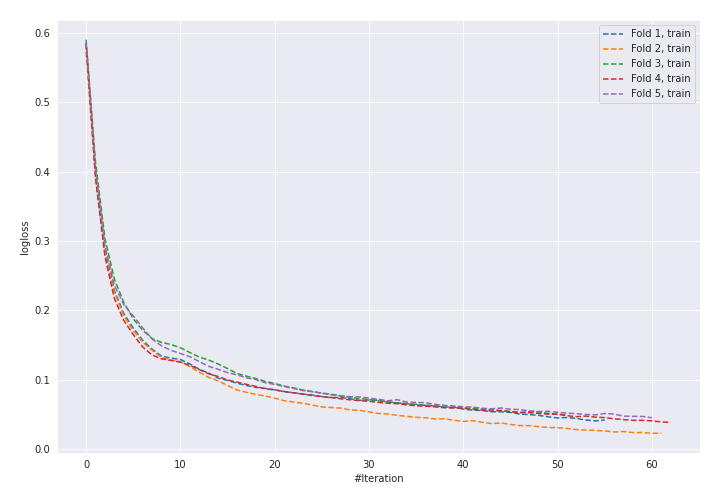
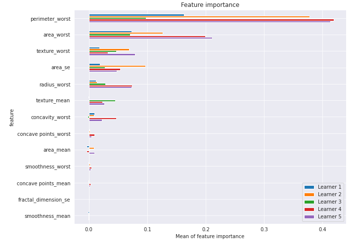

# Summary of 28_NeuralNetwork_SelectedFeatures

[<< Go back](../README.md)

## Neural Network
- **n_jobs**: -1
- **dense_1_size**: 32
- **dense_2_size**: 16
- **learning_rate**: 0.01
- **explain_level**: 2

## Validation
 - **validation_type**: kfold
 - **k_folds**: 5
 - **shuffle**: True
 - **stratify**: True
 - **random_seed**: 1230

## Optimized metric
logloss

## Training time

3.1 seconds

## Metric details
|           |    score |     threshold |
|:----------|---------:|--------------:|
| logloss   | 0.207272 | nan           |
| auc       | 0.977194 | nan           |
| f1        | 0.939252 |   0.5243      |
| accuracy  | 0.938679 |   0.5243      |
| precision | 1        |   0.99947     |
| recall    | 1        |   0.000176157 |
| mcc       | 0.877515 |   0.5243      |

## Confusion matrix (at threshold=0.5243)
|                     |   Predicted as negative |   Predicted as positive |
|:--------------------|------------------------:|------------------------:|
| Labeled as negative |                     197 |                      15 |
| Labeled as positive |                      11 |                     201 |

## Learning curves

## Permutation-based Importance

[<< Go back](../README.md)
