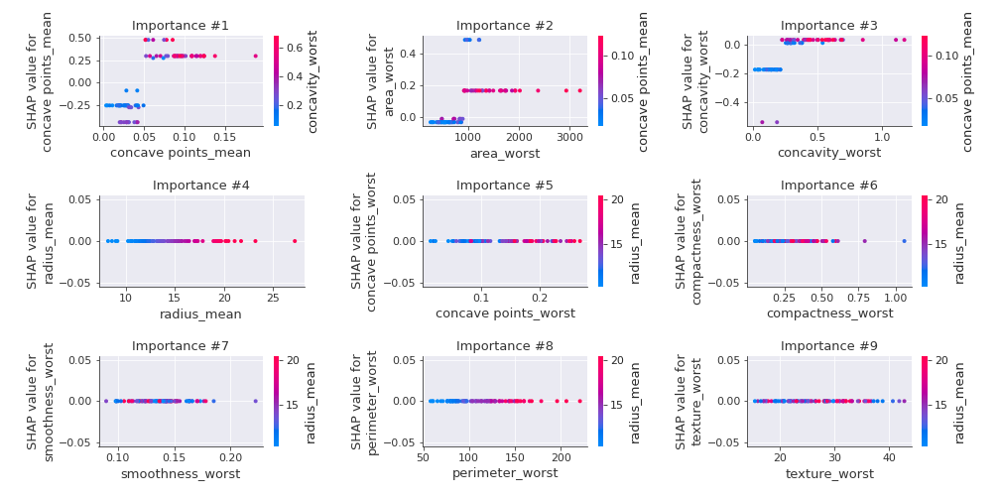

# Summary of 29_DecisionTree

[<< Go back](../README.md)

## Decision Tree
- **n_jobs**: -1
- **criterion**: gini
- **max_depth**: 2
- **explain_level**: 2

## Validation
 - **validation_type**: kfold
 - **k_folds**: 5
 - **shuffle**: True
 - **stratify**: True
 - **random_seed**: 1230

## Optimized metric
logloss

## Training time

26.7 seconds

## Metric details
|           |    score |   threshold |
|:----------|---------:|------------:|
| logloss   | 0.226607 | nan         |
| auc       | 0.955166 | nan         |
| f1        | 0.933649 |   0.378227  |
| accuracy  | 0.933962 |   0.497321  |
| precision | 0.973333 |   0.980728  |
| recall    | 1        |   0.0116129 |
| mcc       | 0.868079 |   0.497321  |

## Confusion matrix (at threshold=0.497321)
|                     |   Predicted as negative |   Predicted as positive |
|:--------------------|------------------------:|------------------------:|
| Labeled as negative |                     200 |                      12 |
| Labeled as positive |                      16 |                     196 |

## Learning curves

## Decision Tree 

### Tree #1

### Rules

if (perimeter_worst > 104.95) and (concavity_worst > 0.218) then class: 1 (proba: 96.3%) | based on 162 samples

if (perimeter_worst <= 104.95) and (concave points_worst <= 0.135) then class: 0 (proba: 98.71%) | based on 155 samples

if (perimeter_worst <= 104.95) and (concave points_worst > 0.135) then class: 1 (proba: 66.67%) | based on 12 samples

if (perimeter_worst > 104.95) and (concavity_worst <= 0.218) then class: 0 (proba: 70.0%) | based on 10 samples

### Tree #2

### Rules

if (perimeter_worst > 104.95) and (concave points_worst > 0.109) then class: 1 (proba: 96.79%) | based on 156 samples

if (perimeter_worst <= 104.95) and (concave points_worst <= 0.135) then class: 0 (proba: 98.71%) | based on 155 samples

if (perimeter_worst > 104.95) and (concave points_worst <= 0.109) then class: 0 (proba: 57.14%) | based on 14 samples

if (perimeter_worst <= 104.95) and (concave points_worst > 0.135) then class: 1 (proba: 71.43%) | based on 14 samples

### Tree #3

### Rules

if (concave points_mean <= 0.051) and (radius_worst <= 16.83) then class: 0 (proba: 97.47%) | based on 158 samples

if (concave points_mean > 0.051) and (concavity_worst > 0.226) then class: 1 (proba: 98.71%) | based on 155 samples

if (concave points_mean <= 0.051) and (radius_worst > 16.83) then class: 1 (proba: 64.71%) | based on 17 samples

if (concave points_mean > 0.051) and (concavity_worst <= 0.226) then class: 0 (proba: 77.78%) | based on 9 samples

### Tree #4

### Rules

if (perimeter_worst > 102.2) and (concave points_worst > 0.107) then class: 1 (proba: 96.93%) | based on 163 samples

if (perimeter_worst <= 102.2) and (concave points_worst <= 0.138) then class: 0 (proba: 98.08%) | based on 156 samples

if (perimeter_worst > 102.2) and (concave points_worst <= 0.107) then class: 0 (proba: 71.43%) | based on 14 samples

if (perimeter_worst <= 102.2) and (concave points_worst > 0.138) then class: 1 (proba: 83.33%) | based on 6 samples

### Tree #5

### Rules

if (concave points_mean <= 0.051) and (area_worst <= 893.65) then class: 0 (proba: 95.78%) | based on 166 samples

if (concave points_mean > 0.051) and (concavity_worst > 0.223) then class: 1 (proba: 99.35%) | based on 154 samples

if (concave points_mean <= 0.051) and (area_worst > 893.65) then class: 1 (proba: 72.73%) | based on 11 samples

if (concave points_mean > 0.051) and (concavity_worst <= 0.223) then class: 0 (proba: 77.78%) | based on 9 samples

## Permutation-based Importance

## SHAP Importance

## SHAP Dependence plots

### Dependence (Fold 1)

### Dependence (Fold 2)

### Dependence (Fold 3)

### Dependence (Fold 4)

### Dependence (Fold 5)

## SHAP Decision plots

### Top-10 Worst decisions for class 0 (Fold 1)

### Top-10 Worst decisions for class 0 (Fold 2)

### Top-10 Worst decisions for class 0 (Fold 3)

### Top-10 Worst decisions for class 0 (Fold 4)

### Top-10 Worst decisions for class 0 (Fold 5)

### Top-10 Best decisions for class 0 (Fold 1)

### Top-10 Best decisions for class 0 (Fold 2)

### Top-10 Best decisions for class 0 (Fold 3)

### Top-10 Best decisions for class 0 (Fold 4)

### Top-10 Best decisions for class 0 (Fold 5)

### Top-10 Worst decisions for class 1 (Fold 1)

### Top-10 Worst decisions for class 1 (Fold 2)

### Top-10 Worst decisions for class 1 (Fold 3)

### Top-10 Worst decisions for class 1 (Fold 4)

### Top-10 Worst decisions for class 1 (Fold 5)

### Top-10 Best decisions for class 1 (Fold 1)

### Top-10 Best decisions for class 1 (Fold 2)

### Top-10 Best decisions for class 1 (Fold 3)

### Top-10 Best decisions for class 1 (Fold 4)

### Top-10 Best decisions for class 1 (Fold 5)

[<< Go back](../README.md)
