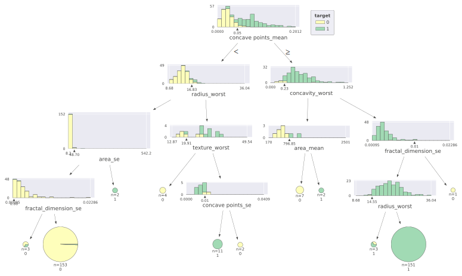
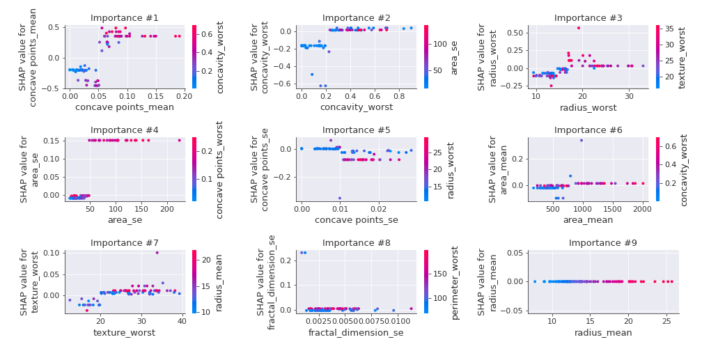
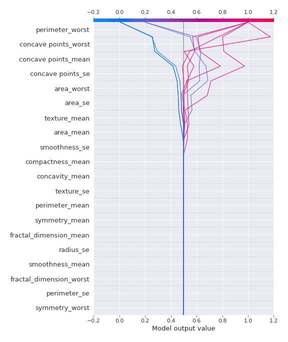
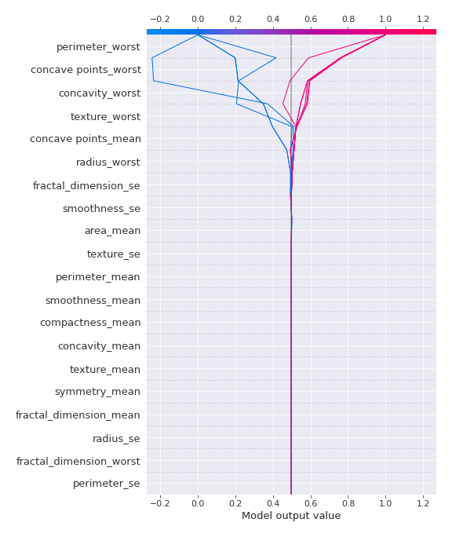
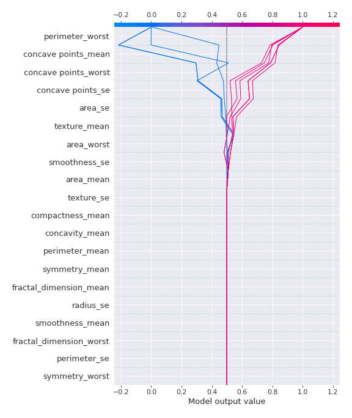

# Summary of 2_DecisionTree

[<< Go back](../README.md)

## Decision Tree
- **n_jobs**: -1
- **criterion**: gini
- **max_depth**: 4
- **explain_level**: 2

## Validation
 - **validation_type**: kfold
 - **k_folds**: 5
 - **shuffle**: True
 - **stratify**: True
 - **random_seed**: 1230

## Optimized metric
logloss

## Training time

39.7 seconds

## Metric details
|           |    score |   threshold |
|:----------|---------:|------------:|
| logloss   | 0.920591 |  nan        |
| auc       | 0.914905 |  nan        |
| f1        | 0.921615 |    0.336601 |
| accuracy  | 0.92217  |    0.336601 |
| precision | 0.92823  |    0.336601 |
| recall    | 0.933962 |    0        |
| mcc       | 0.844424 |    0.336601 |

## Confusion matrix (at threshold=0.336601)
|                     |   Predicted as negative |   Predicted as positive |
|:--------------------|------------------------:|------------------------:|
| Labeled as negative |                     197 |                      15 |
| Labeled as positive |                      18 |                     194 |

## Learning curves

## Decision Tree 

### Tree #1

### Rules

if (perimeter_worst > 104.95) and (concavity_worst > 0.218) and (concave points_mean > 0.044) and (fractal_dimension_se <= 0.013) then class: 1 (proba: 100.0%) | based on 149 samples

if (perimeter_worst <= 104.95) and (concave points_worst <= 0.135) and (smoothness_se > 0.003) and (texture_worst <= 32.78) then class: 0 (proba: 100.0%) | based on 141 samples

if (perimeter_worst <= 104.95) and (concave points_worst <= 0.135) and (smoothness_se > 0.003) and (texture_worst > 32.78) then class: 0 (proba: 91.67%) | based on 12 samples

if (perimeter_worst <= 104.95) and (concave points_worst > 0.135) and (texture_worst > 25.94) then class: 1 (proba: 100.0%) | based on 8 samples

if (perimeter_worst > 104.95) and (concavity_worst <= 0.218) and (texture_worst <= 29.77) then class: 0 (proba: 100.0%) | based on 7 samples

if (perimeter_worst > 104.95) and (concavity_worst > 0.218) and (concave points_mean <= 0.044) and (radius_worst > 17.48) then class: 1 (proba: 100.0%) | based on 6 samples

if (perimeter_worst > 104.95) and (concavity_worst > 0.218) and (concave points_mean <= 0.044) and (radius_worst <= 17.48) then class: 0 (proba: 83.33%) | based on 6 samples

if (perimeter_worst <= 104.95) and (concave points_worst > 0.135) and (texture_worst <= 25.94) then class: 0 (proba: 100.0%) | based on 4 samples

if (perimeter_worst > 104.95) and (concavity_worst <= 0.218) and (texture_worst > 29.77) then class: 1 (proba: 100.0%) | based on 3 samples

if (perimeter_worst > 104.95) and (concavity_worst > 0.218) and (concave points_mean > 0.044) and (fractal_dimension_se > 0.013) then class: 0 (proba: 100.0%) | based on 1 samples

if (perimeter_worst <= 104.95) and (concave points_worst <= 0.135) and (smoothness_se <= 0.003) and (area_mean > 425.55) then class: 1 (proba: 100.0%) | based on 1 samples

if (perimeter_worst <= 104.95) and (concave points_worst <= 0.135) and (smoothness_se <= 0.003) and (area_mean <= 425.55) then class: 0 (proba: 100.0%) | based on 1 samples

### Tree #2

### Rules

if (perimeter_worst <= 104.95) and (concave points_worst <= 0.135) and (area_se <= 48.975) then class: 0 (proba: 100.0%) | based on 153 samples

if (perimeter_worst > 104.95) and (concave points_worst > 0.109) and (texture_mean > 16.605) and (concavity_se <= 0.13) then class: 1 (proba: 100.0%) | based on 141 samples

if (perimeter_worst > 104.95) and (concave points_worst > 0.109) and (texture_mean <= 16.605) and (concave points_worst > 0.144) then class: 1 (proba: 100.0%) | based on 9 samples

if (perimeter_worst <= 104.95) and (concave points_worst > 0.135) and (concave points_mean > 0.052) then class: 1 (proba: 100.0%) | based on 9 samples

if (perimeter_worst > 104.95) and (concave points_worst <= 0.109) and (texture_mean <= 19.36) then class: 0 (proba: 100.0%) | based on 7 samples

if (perimeter_worst > 104.95) and (concave points_worst <= 0.109) and (texture_mean > 19.36) and (texture_se <= 1.843) then class: 1 (proba: 100.0%) | based on 6 samples

if (perimeter_worst > 104.95) and (concave points_worst > 0.109) and (texture_mean <= 16.605) and (concave points_worst <= 0.144) then class: 0 (proba: 80.0%) | based on 5 samples

if (perimeter_worst <= 104.95) and (concave points_worst > 0.135) and (concave points_mean <= 0.052) and (area_se <= 26.9) then class: 0 (proba: 100.0%) | based on 4 samples

if (perimeter_worst <= 104.95) and (concave points_worst <= 0.135) and (area_se > 48.975) then class: 1 (proba: 100.0%) | based on 2 samples

if (perimeter_worst > 104.95) and (concave points_worst > 0.109) and (texture_mean > 16.605) and (concavity_se > 0.13) then class: 0 (proba: 100.0%) | based on 1 samples

if (perimeter_worst > 104.95) and (concave points_worst <= 0.109) and (texture_mean > 19.36) and (texture_se > 1.843) then class: 0 (proba: 100.0%) | based on 1 samples

if (perimeter_worst <= 104.95) and (concave points_worst > 0.135) and (concave points_mean <= 0.052) and (area_se > 26.9) then class: 1 (proba: 100.0%) | based on 1 samples

### Tree #3

### Rules

if (concave points_mean <= 0.051) and (radius_worst <= 16.83) and (area_se <= 48.7) and (fractal_dimension_se > 0.001) then class: 0 (proba: 99.35%) | based on 153 samples

if (concave points_mean > 0.051) and (concavity_worst > 0.226) and (fractal_dimension_se <= 0.013) and (radius_worst > 14.55) then class: 1 (proba: 100.0%) | based on 151 samples

if (concave points_mean <= 0.051) and (radius_worst > 16.83) and (texture_worst > 19.91) and (concave points_se <= 0.01) then class: 1 (proba: 100.0%) | based on 11 samples

if (concave points_mean > 0.051) and (concavity_worst <= 0.226) and (area_mean <= 796.85) then class: 0 (proba: 100.0%) | based on 7 samples

if (concave points_mean <= 0.051) and (radius_worst > 16.83) and (texture_worst <= 19.91) then class: 0 (proba: 100.0%) | based on 4 samples

if (concave points_mean > 0.051) and (concavity_worst > 0.226) and (fractal_dimension_se <= 0.013) and (radius_worst <= 14.55) then class: 1 (proba: 66.67%) | based on 3 samples

if (concave points_mean <= 0.051) and (radius_worst <= 16.83) and (area_se <= 48.7) and (fractal_dimension_se <= 0.001) then class: 0 (proba: 66.67%) | based on 3 samples

if (concave points_mean > 0.051) and (concavity_worst <= 0.226) and (area_mean > 796.85) then class: 1 (proba: 100.0%) | based on 2 samples

if (concave points_mean <= 0.051) and (radius_worst > 16.83) and (texture_worst > 19.91) and (concave points_se > 0.01) then class: 0 (proba: 100.0%) | based on 2 samples

if (concave points_mean <= 0.051) and (radius_worst <= 16.83) and (area_se > 48.7) then class: 1 (proba: 100.0%) | based on 2 samples

if (concave points_mean > 0.051) and (concavity_worst > 0.226) and (fractal_dimension_se > 0.013) then class: 0 (proba: 100.0%) | based on 1 samples

### Tree #4

### Rules

if (perimeter_worst > 102.2) and (concave points_worst > 0.107) and (smoothness_worst > 0.096) and (concave points_mean > 0.046) then class: 1 (proba: 99.35%) | based on 153 samples

if (perimeter_worst <= 102.2) and (concave points_worst <= 0.138) and (area_se <= 48.975) and (texture_worst <= 32.78) then class: 0 (proba: 100.0%) | based on 141 samples

if (perimeter_worst <= 102.2) and (concave points_worst <= 0.138) and (area_se <= 48.975) and (texture_worst > 32.78) then class: 0 (proba: 91.67%) | based on 12 samples

if (perimeter_worst > 102.2) and (concave points_worst <= 0.107) and (texture_worst <= 30.29) and (compactness_worst <= 0.278) then class: 0 (proba: 100.0%) | based on 10 samples

if (perimeter_worst > 102.2) and (concave points_worst > 0.107) and (smoothness_worst > 0.096) and (concave points_mean <= 0.046) then class: 1 (proba: 66.67%) | based on 9 samples

if (perimeter_worst <= 102.2) and (concave points_worst > 0.138) and (texture_se > 0.817) then class: 1 (proba: 100.0%) | based on 5 samples

if (perimeter_worst > 102.2) and (concave points_worst <= 0.107) and (texture_worst > 30.29) then class: 1 (proba: 100.0%) | based on 3 samples

if (perimeter_worst <= 102.2) and (concave points_worst <= 0.138) and (area_se > 48.975) and (smoothness_se <= 0.007) then class: 1 (proba: 100.0%) | based on 2 samples

if (perimeter_worst > 102.2) and (concave points_worst > 0.107) and (smoothness_worst <= 0.096) then class: 0 (proba: 100.0%) | based on 1 samples

if (perimeter_worst > 102.2) and (concave points_worst <= 0.107) and (texture_worst <= 30.29) and (compactness_worst > 0.278) then class: 1 (proba: 100.0%) | based on 1 samples

if (perimeter_worst <= 102.2) and (concave points_worst > 0.138) and (texture_se <= 0.817) then class: 0 (proba: 100.0%) | based on 1 samples

if (perimeter_worst <= 102.2) and (concave points_worst <= 0.138) and (area_se > 48.975) and (smoothness_se > 0.007) then class: 0 (proba: 100.0%) | based on 1 samples

### Tree #5

### Rules

if (perimeter_worst <= 105.95) and (concave points_worst <= 0.142) and (area_se <= 46.925) and (area_worst <= 754.1) then class: 0 (proba: 99.35%) | based on 153 samples

if (perimeter_worst > 105.95) and (concave points_mean > 0.049) then class: 1 (proba: 100.0%) | based on 147 samples

if (perimeter_worst <= 105.95) and (concave points_worst > 0.142) and (area_mean > 306.05) then class: 1 (proba: 100.0%) | based on 10 samples

if (perimeter_worst <= 105.95) and (concave points_worst <= 0.142) and (area_se <= 46.925) and (area_worst > 754.1) then class: 0 (proba: 80.0%) | based on 10 samples

if (perimeter_worst > 105.95) and (concave points_mean <= 0.049) and (concave points_se > 0.009) and (texture_mean <= 23.545) then class: 0 (proba: 100.0%) | based on 8 samples

if (perimeter_worst > 105.95) and (concave points_mean <= 0.049) and (concave points_se <= 0.009) then class: 1 (proba: 100.0%) | based on 6 samples

if (perimeter_worst > 105.95) and (concave points_mean <= 0.049) and (concave points_se > 0.009) and (texture_mean > 23.545) then class: 1 (proba: 100.0%) | based on 2 samples

if (perimeter_worst <= 105.95) and (concave points_worst <= 0.142) and (area_se > 46.925) and (smoothness_se <= 0.007) then class: 1 (proba: 100.0%) | based on 2 samples

if (perimeter_worst <= 105.95) and (concave points_worst > 0.142) and (area_mean <= 306.05) then class: 0 (proba: 100.0%) | based on 1 samples

if (perimeter_worst <= 105.95) and (concave points_worst <= 0.142) and (area_se > 46.925) and (smoothness_se > 0.007) then class: 0 (proba: 100.0%) | based on 1 samples

## Permutation-based Importance

## SHAP Importance

## SHAP Dependence plots

### Dependence (Fold 1)

### Dependence (Fold 2)

### Dependence (Fold 3)

### Dependence (Fold 4)

### Dependence (Fold 5)

## SHAP Decision plots

### Top-10 Worst decisions for class 0 (Fold 1)

### Top-10 Worst decisions for class 0 (Fold 2)

### Top-10 Worst decisions for class 0 (Fold 3)

### Top-10 Worst decisions for class 0 (Fold 4)

### Top-10 Worst decisions for class 0 (Fold 5)

### Top-10 Best decisions for class 0 (Fold 1)

### Top-10 Best decisions for class 0 (Fold 2)

### Top-10 Best decisions for class 0 (Fold 3)

### Top-10 Best decisions for class 0 (Fold 4)

### Top-10 Best decisions for class 0 (Fold 5)

### Top-10 Worst decisions for class 1 (Fold 1)

### Top-10 Worst decisions for class 1 (Fold 2)

### Top-10 Worst decisions for class 1 (Fold 3)

### Top-10 Worst decisions for class 1 (Fold 4)

### Top-10 Worst decisions for class 1 (Fold 5)

### Top-10 Best decisions for class 1 (Fold 1)

### Top-10 Best decisions for class 1 (Fold 2)

### Top-10 Best decisions for class 1 (Fold 3)

### Top-10 Best decisions for class 1 (Fold 4)

### Top-10 Best decisions for class 1 (Fold 5)

[<< Go back](../README.md)
