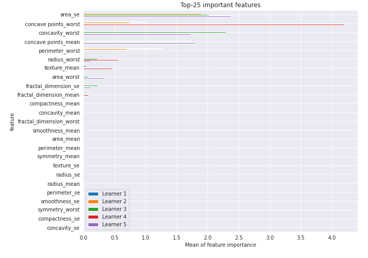
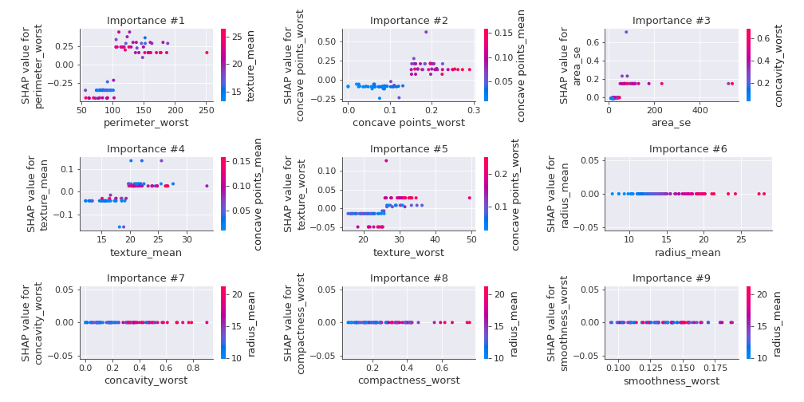

# Summary of 36_DecisionTree

[<< Go back](../README.md)

## Decision Tree
- **n_jobs**: -1
- **criterion**: entropy
- **max_depth**: 3
- **explain_level**: 2

## Validation
 - **validation_type**: kfold
 - **k_folds**: 5
 - **shuffle**: True
 - **stratify**: True
 - **random_seed**: 1230

## Optimized metric
logloss

## Training time

32.3 seconds

## Metric details
|           |    score |   threshold |
|:----------|---------:|------------:|
| logloss   | 0.50384  |   nan       |
| auc       | 0.953754 |   nan       |
| f1        | 0.9375   |     0.50641 |
| accuracy  | 0.938679 |     0.50641 |
| precision | 0.955882 |     0.50641 |
| recall    | 0.966981 |     0       |
| mcc       | 0.877984 |     0.50641 |

## Confusion matrix (at threshold=0.50641)
|                     |   Predicted as negative |   Predicted as positive |
|:--------------------|------------------------:|------------------------:|
| Labeled as negative |                     203 |                       9 |
| Labeled as positive |                      17 |                     195 |

## Learning curves

## Decision Tree 

### Tree #1

### Rules

if (perimeter_worst <= 104.95) and (concave points_worst <= 0.135) and (texture_worst <= 30.145) then class: 0 (proba: 100.0%) | based on 136 samples

if (perimeter_worst > 104.95) and (concave points_worst > 0.151) then class: 1 (proba: 100.0%) | based on 126 samples

if (perimeter_worst > 104.95) and (concave points_worst <= 0.151) and (texture_mean > 19.655) then class: 1 (proba: 96.0%) | based on 25 samples

if (perimeter_worst > 104.95) and (concave points_worst <= 0.151) and (texture_mean <= 19.655) then class: 0 (proba: 57.14%) | based on 21 samples

if (perimeter_worst <= 104.95) and (concave points_worst <= 0.135) and (texture_worst > 30.145) then class: 0 (proba: 89.47%) | based on 19 samples

if (perimeter_worst <= 104.95) and (concave points_worst > 0.135) and (texture_worst > 25.94) then class: 1 (proba: 100.0%) | based on 8 samples

if (perimeter_worst <= 104.95) and (concave points_worst > 0.135) and (texture_worst <= 25.94) then class: 0 (proba: 100.0%) | based on 4 samples

### Tree #2

### Rules

if (perimeter_worst <= 104.95) and (concave points_worst <= 0.135) and (area_se <= 48.975) then class: 0 (proba: 100.0%) | based on 153 samples

if (perimeter_worst > 104.95) and (concave points_worst > 0.151) then class: 1 (proba: 100.0%) | based on 121 samples

if (perimeter_worst > 104.95) and (concave points_worst <= 0.151) and (texture_mean > 19.655) then class: 1 (proba: 100.0%) | based on 26 samples

if (perimeter_worst > 104.95) and (concave points_worst <= 0.151) and (texture_mean <= 19.655) then class: 0 (proba: 56.52%) | based on 23 samples

if (perimeter_worst <= 104.95) and (concave points_worst > 0.135) and (texture_worst > 26.0) then class: 1 (proba: 100.0%) | based on 9 samples

if (perimeter_worst <= 104.95) and (concave points_worst > 0.135) and (texture_worst <= 26.0) then class: 0 (proba: 80.0%) | based on 5 samples

if (perimeter_worst <= 104.95) and (concave points_worst <= 0.135) and (area_se > 48.975) then class: 1 (proba: 100.0%) | based on 2 samples

### Tree #3

### Rules

if (concave points_mean <= 0.051) and (radius_worst <= 16.83) and (area_se <= 48.7) then class: 0 (proba: 98.72%) | based on 156 samples

if (concave points_mean > 0.051) and (concavity_worst > 0.226) and (area_worst > 710.2) then class: 1 (proba: 100.0%) | based on 149 samples

if (concave points_mean <= 0.051) and (radius_worst > 16.83) and (texture_worst > 19.91) then class: 1 (proba: 84.62%) | based on 13 samples

if (concave points_mean > 0.051) and (concavity_worst <= 0.226) and (fractal_dimension_se > 0.003) then class: 0 (proba: 100.0%) | based on 7 samples

if (concave points_mean > 0.051) and (concavity_worst > 0.226) and (area_worst <= 710.2) then class: 1 (proba: 66.67%) | based on 6 samples

if (concave points_mean <= 0.051) and (radius_worst > 16.83) and (texture_worst <= 19.91) then class: 0 (proba: 100.0%) | based on 4 samples

if (concave points_mean > 0.051) and (concavity_worst <= 0.226) and (fractal_dimension_se <= 0.003) then class: 1 (proba: 100.0%) | based on 2 samples

if (concave points_mean <= 0.051) and (radius_worst <= 16.83) and (area_se > 48.7) then class: 1 (proba: 100.0%) | based on 2 samples

### Tree #4

### Rules

if (concave points_worst <= 0.135) and (radius_worst <= 16.8) and (area_se <= 38.35) then class: 0 (proba: 98.75%) | based on 160 samples

if (concave points_worst > 0.135) and (concave points_worst > 0.151) then class: 1 (proba: 100.0%) | based on 138 samples

if (concave points_worst <= 0.135) and (radius_worst > 16.8) and (texture_mean > 18.495) then class: 1 (proba: 100.0%) | based on 15 samples

if (concave points_worst > 0.135) and (concave points_worst <= 0.151) and (fractal_dimension_mean <= 0.062) then class: 1 (proba: 100.0%) | based on 9 samples

if (concave points_worst > 0.135) and (concave points_worst <= 0.151) and (fractal_dimension_mean > 0.062) then class: 0 (proba: 57.14%) | based on 7 samples

if (concave points_worst <= 0.135) and (radius_worst <= 16.8) and (area_se > 38.35) then class: 0 (proba: 50.0%) | based on 6 samples

if (concave points_worst <= 0.135) and (radius_worst > 16.8) and (texture_mean <= 18.495) then class: 0 (proba: 100.0%) | based on 4 samples

### Tree #5

### Rules

if (concave points_mean > 0.051) and (concavity_worst > 0.223) and (radius_worst > 14.55) then class: 1 (proba: 100.0%) | based on 150 samples

if (concave points_mean <= 0.051) and (area_worst <= 766.45) and (area_se <= 43.725) then class: 0 (proba: 99.33%) | based on 149 samples

if (concave points_mean <= 0.051) and (area_worst > 766.45) and (texture_mean <= 19.98) then class: 0 (proba: 81.25%) | based on 16 samples

if (concave points_mean <= 0.051) and (area_worst > 766.45) and (texture_mean > 19.98) then class: 1 (proba: 90.0%) | based on 10 samples

if (concave points_mean > 0.051) and (concavity_worst <= 0.223) and (fractal_dimension_se > 0.003) then class: 0 (proba: 100.0%) | based on 7 samples

if (concave points_mean > 0.051) and (concavity_worst > 0.223) and (radius_worst <= 14.55) then class: 1 (proba: 75.0%) | based on 4 samples

if (concave points_mean > 0.051) and (concavity_worst <= 0.223) and (fractal_dimension_se <= 0.003) then class: 1 (proba: 100.0%) | based on 2 samples

if (concave points_mean <= 0.051) and (area_worst <= 766.45) and (area_se > 43.725) then class: 1 (proba: 100.0%) | based on 2 samples

## Permutation-based Importance

## SHAP Importance

## SHAP Dependence plots

### Dependence (Fold 1)

### Dependence (Fold 2)

### Dependence (Fold 3)

### Dependence (Fold 4)

### Dependence (Fold 5)

## SHAP Decision plots

### Top-10 Worst decisions for class 0 (Fold 1)

### Top-10 Worst decisions for class 0 (Fold 2)

### Top-10 Worst decisions for class 0 (Fold 3)

### Top-10 Worst decisions for class 0 (Fold 4)

### Top-10 Worst decisions for class 0 (Fold 5)

### Top-10 Best decisions for class 0 (Fold 1)

### Top-10 Best decisions for class 0 (Fold 2)

### Top-10 Best decisions for class 0 (Fold 3)

### Top-10 Best decisions for class 0 (Fold 4)

### Top-10 Best decisions for class 0 (Fold 5)

### Top-10 Worst decisions for class 1 (Fold 1)

### Top-10 Worst decisions for class 1 (Fold 2)

### Top-10 Worst decisions for class 1 (Fold 3)

### Top-10 Worst decisions for class 1 (Fold 4)

### Top-10 Worst decisions for class 1 (Fold 5)

### Top-10 Best decisions for class 1 (Fold 1)

### Top-10 Best decisions for class 1 (Fold 2)

### Top-10 Best decisions for class 1 (Fold 3)

### Top-10 Best decisions for class 1 (Fold 4)

### Top-10 Best decisions for class 1 (Fold 5)

[<< Go back](../README.md)
