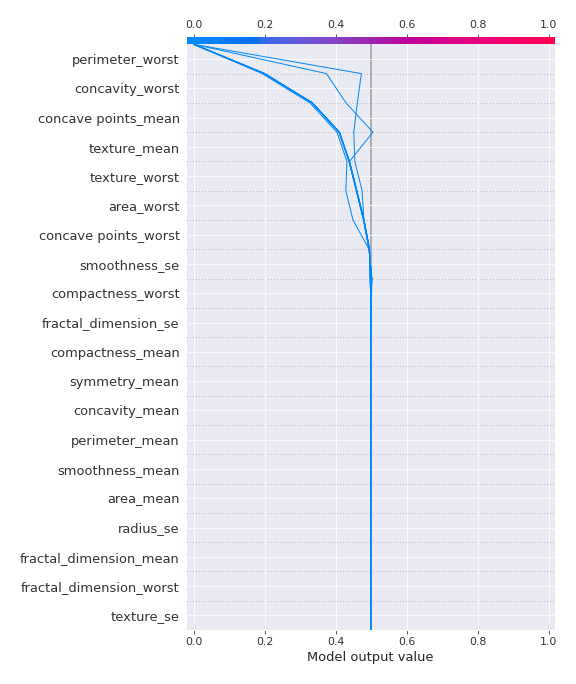

# Summary of 3_DecisionTree

[<< Go back](../README.md)

## Decision Tree
- **n_jobs**: -1
- **criterion**: gini
- **max_depth**: 4
- **explain_level**: 2

## Validation
 - **validation_type**: kfold
 - **k_folds**: 5
 - **shuffle**: True
 - **stratify**: True
 - **random_seed**: 1230

## Optimized metric
logloss

## Training time

41.1 seconds

## Metric details
|           |    score |   threshold |
|:----------|---------:|------------:|
| logloss   | 0.788025 |  nan        |
| auc       | 0.926642 |  nan        |
| f1        | 0.931442 |    0.336601 |
| accuracy  | 0.931604 |    0.336601 |
| precision | 0.933649 |    0.336601 |
| recall    | 0.948113 |    0        |
| mcc       | 0.863217 |    0.336601 |

## Confusion matrix (at threshold=0.336601)
|                     |   Predicted as negative |   Predicted as positive |
|:--------------------|------------------------:|------------------------:|
| Labeled as negative |                     198 |                      14 |
| Labeled as positive |                      15 |                     197 |

## Learning curves

## Decision Tree 

### Tree #1

### Rules

if (perimeter_worst > 104.95) and (concavity_worst > 0.218) and (concave points_mean > 0.044) and (fractal_dimension_se <= 0.013) then class: 1 (proba: 100.0%) | based on 149 samples

if (perimeter_worst <= 104.95) and (concave points_worst <= 0.135) and (smoothness_se > 0.003) and (texture_worst <= 32.78) then class: 0 (proba: 100.0%) | based on 141 samples

if (perimeter_worst <= 104.95) and (concave points_worst <= 0.135) and (smoothness_se > 0.003) and (texture_worst > 32.78) then class: 0 (proba: 91.67%) | based on 12 samples

if (perimeter_worst <= 104.95) and (concave points_worst > 0.135) and (texture_worst > 25.94) then class: 1 (proba: 100.0%) | based on 8 samples

if (perimeter_worst > 104.95) and (concavity_worst <= 0.218) and (texture_mean <= 21.26) then class: 0 (proba: 100.0%) | based on 7 samples

if (perimeter_worst > 104.95) and (concavity_worst > 0.218) and (concave points_mean <= 0.044) and (area_worst > 949.85) then class: 1 (proba: 100.0%) | based on 6 samples

if (perimeter_worst > 104.95) and (concavity_worst > 0.218) and (concave points_mean <= 0.044) and (area_worst <= 949.85) then class: 0 (proba: 83.33%) | based on 6 samples

if (perimeter_worst <= 104.95) and (concave points_worst > 0.135) and (texture_worst <= 25.94) then class: 0 (proba: 100.0%) | based on 4 samples

if (perimeter_worst > 104.95) and (concavity_worst <= 0.218) and (texture_mean > 21.26) then class: 1 (proba: 100.0%) | based on 3 samples

if (perimeter_worst > 104.95) and (concavity_worst > 0.218) and (concave points_mean > 0.044) and (fractal_dimension_se > 0.013) then class: 0 (proba: 100.0%) | based on 1 samples

if (perimeter_worst <= 104.95) and (concave points_worst <= 0.135) and (smoothness_se <= 0.003) and (compactness_worst > 0.116) then class: 1 (proba: 100.0%) | based on 1 samples

if (perimeter_worst <= 104.95) and (concave points_worst <= 0.135) and (smoothness_se <= 0.003) and (compactness_worst <= 0.116) then class: 0 (proba: 100.0%) | based on 1 samples

### Tree #2

### Rules

if (perimeter_worst <= 104.95) and (concave points_worst <= 0.135) and (radius_se <= 0.643) then class: 0 (proba: 100.0%) | based on 153 samples

if (perimeter_worst > 104.95) and (concave points_worst > 0.109) and (texture_mean > 16.605) and (smoothness_mean > 0.079) then class: 1 (proba: 100.0%) | based on 141 samples

if (perimeter_worst > 104.95) and (concave points_worst > 0.109) and (texture_mean <= 16.605) and (concave points_worst > 0.144) then class: 1 (proba: 100.0%) | based on 9 samples

if (perimeter_worst <= 104.95) and (concave points_worst > 0.135) and (texture_worst > 26.0) then class: 1 (proba: 100.0%) | based on 9 samples

if (perimeter_worst > 104.95) and (concave points_worst <= 0.109) and (texture_mean <= 19.36) then class: 0 (proba: 100.0%) | based on 7 samples

if (perimeter_worst > 104.95) and (concave points_worst <= 0.109) and (texture_mean > 19.36) and (smoothness_worst > 0.088) then class: 1 (proba: 100.0%) | based on 6 samples

if (perimeter_worst > 104.95) and (concave points_worst > 0.109) and (texture_mean <= 16.605) and (concave points_worst <= 0.144) then class: 0 (proba: 80.0%) | based on 5 samples

if (perimeter_worst <= 104.95) and (concave points_worst > 0.135) and (texture_worst <= 26.0) and (smoothness_worst <= 0.171) then class: 0 (proba: 100.0%) | based on 4 samples

if (perimeter_worst <= 104.95) and (concave points_worst <= 0.135) and (radius_se > 0.643) then class: 1 (proba: 100.0%) | based on 2 samples

if (perimeter_worst > 104.95) and (concave points_worst > 0.109) and (texture_mean > 16.605) and (smoothness_mean <= 0.079) then class: 0 (proba: 100.0%) | based on 1 samples

if (perimeter_worst > 104.95) and (concave points_worst <= 0.109) and (texture_mean > 19.36) and (smoothness_worst <= 0.088) then class: 0 (proba: 100.0%) | based on 1 samples

if (perimeter_worst <= 104.95) and (concave points_worst > 0.135) and (texture_worst <= 26.0) and (smoothness_worst > 0.171) then class: 1 (proba: 100.0%) | based on 1 samples

### Tree #3

### Rules

if (concave points_mean <= 0.051) and (radius_worst <= 16.83) and (radius_se <= 0.603) and (fractal_dimension_se > 0.001) then class: 0 (proba: 99.35%) | based on 153 samples

if (concave points_mean > 0.051) and (concavity_worst > 0.226) and (fractal_dimension_se <= 0.013) and (area_worst > 591.45) then class: 1 (proba: 100.0%) | based on 151 samples

if (concave points_mean <= 0.051) and (radius_worst > 16.83) and (symmetry_mean > 0.153) and (smoothness_worst > 0.094) then class: 1 (proba: 91.67%) | based on 12 samples

if (concave points_mean > 0.051) and (concavity_worst <= 0.226) and (area_worst <= 1033.45) then class: 0 (proba: 100.0%) | based on 7 samples

if (concave points_mean <= 0.051) and (radius_worst > 16.83) and (symmetry_mean <= 0.153) then class: 0 (proba: 100.0%) | based on 4 samples

if (concave points_mean > 0.051) and (concavity_worst > 0.226) and (fractal_dimension_se <= 0.013) and (area_worst <= 591.45) then class: 1 (proba: 66.67%) | based on 3 samples

if (concave points_mean <= 0.051) and (radius_worst <= 16.83) and (radius_se <= 0.603) and (fractal_dimension_se <= 0.001) then class: 0 (proba: 66.67%) | based on 3 samples

if (concave points_mean > 0.051) and (concavity_worst <= 0.226) and (area_worst > 1033.45) then class: 1 (proba: 100.0%) | based on 2 samples

if (concave points_mean <= 0.051) and (radius_worst <= 16.83) and (radius_se > 0.603) then class: 1 (proba: 100.0%) | based on 2 samples

if (concave points_mean > 0.051) and (concavity_worst > 0.226) and (fractal_dimension_se > 0.013) then class: 0 (proba: 100.0%) | based on 1 samples

if (concave points_mean <= 0.051) and (radius_worst > 16.83) and (symmetry_mean > 0.153) and (smoothness_worst <= 0.094) then class: 0 (proba: 100.0%) | based on 1 samples

### Tree #4

### Rules

if (perimeter_worst > 102.2) and (concave points_worst > 0.107) and (smoothness_mean > 0.079) and (concave points_mean > 0.046) then class: 1 (proba: 99.35%) | based on 153 samples

if (perimeter_worst <= 102.2) and (concave points_worst <= 0.138) and (radius_se <= 0.643) and (texture_worst <= 32.78) then class: 0 (proba: 100.0%) | based on 141 samples

if (perimeter_worst <= 102.2) and (concave points_worst <= 0.138) and (radius_se <= 0.643) and (texture_worst > 32.78) then class: 0 (proba: 91.67%) | based on 12 samples

if (perimeter_worst > 102.2) and (concave points_worst <= 0.107) and (texture_worst <= 30.29) and (symmetry_mean <= 0.179) then class: 0 (proba: 100.0%) | based on 10 samples

if (perimeter_worst > 102.2) and (concave points_worst > 0.107) and (smoothness_mean > 0.079) and (concave points_mean <= 0.046) then class: 1 (proba: 66.67%) | based on 9 samples

if (perimeter_worst <= 102.2) and (concave points_worst > 0.138) and (texture_worst > 25.77) then class: 1 (proba: 100.0%) | based on 5 samples

if (perimeter_worst > 102.2) and (concave points_worst <= 0.107) and (texture_worst > 30.29) then class: 1 (proba: 100.0%) | based on 3 samples

if (perimeter_worst <= 102.2) and (concave points_worst <= 0.138) and (radius_se > 0.643) and (concavity_worst <= 0.142) then class: 1 (proba: 100.0%) | based on 2 samples

if (perimeter_worst > 102.2) and (concave points_worst > 0.107) and (smoothness_mean <= 0.079) then class: 0 (proba: 100.0%) | based on 1 samples

if (perimeter_worst > 102.2) and (concave points_worst <= 0.107) and (texture_worst <= 30.29) and (symmetry_mean > 0.179) then class: 1 (proba: 100.0%) | based on 1 samples

if (perimeter_worst <= 102.2) and (concave points_worst > 0.138) and (texture_worst <= 25.77) then class: 0 (proba: 100.0%) | based on 1 samples

if (perimeter_worst <= 102.2) and (concave points_worst <= 0.138) and (radius_se > 0.643) and (concavity_worst > 0.142) then class: 0 (proba: 100.0%) | based on 1 samples

### Tree #5

### Rules

if (concave points_mean <= 0.051) and (area_mean <= 696.25) and (area_se <= 38.605) and (compactness_worst <= 0.455) then class: 0 (proba: 98.14%) | based on 161 samples

if (concave points_mean > 0.051) and (concavity_worst > 0.223) and (area_worst > 591.45) then class: 1 (proba: 100.0%) | based on 150 samples

if (concave points_mean <= 0.051) and (area_mean > 696.25) and (smoothness_mean <= 0.094) and (concavity_se <= 0.028) then class: 1 (proba: 100.0%) | based on 8 samples

if (concave points_mean > 0.051) and (concavity_worst <= 0.223) and (fractal_dimension_worst > 0.068) then class: 0 (proba: 100.0%) | based on 7 samples

if (concave points_mean > 0.051) and (concavity_worst > 0.223) and (area_worst <= 591.45) and (radius_mean <= 12.235) then class: 1 (proba: 100.0%) | based on 3 samples

if (concave points_mean <= 0.051) and (area_mean <= 696.25) and (area_se > 38.605) and (fractal_dimension_se > 0.002) then class: 1 (proba: 100.0%) | based on 3 samples

if (concave points_mean > 0.051) and (concavity_worst <= 0.223) and (fractal_dimension_worst <= 0.068) then class: 1 (proba: 100.0%) | based on 2 samples

if (concave points_mean <= 0.051) and (area_mean > 696.25) and (smoothness_mean > 0.094) then class: 0 (proba: 100.0%) | based on 2 samples

if (concave points_mean > 0.051) and (concavity_worst > 0.223) and (area_worst <= 591.45) and (radius_mean > 12.235) then class: 0 (proba: 100.0%) | based on 1 samples

if (concave points_mean <= 0.051) and (area_mean > 696.25) and (smoothness_mean <= 0.094) and (concavity_se > 0.028) then class: 0 (proba: 100.0%) | based on 1 samples

if (concave points_mean <= 0.051) and (area_mean <= 696.25) and (area_se > 38.605) and (fractal_dimension_se <= 0.002) then class: 0 (proba: 100.0%) | based on 1 samples

if (concave points_mean <= 0.051) and (area_mean <= 696.25) and (area_se <= 38.605) and (compactness_worst > 0.455) then class: 1 (proba: 100.0%) | based on 1 samples

## Permutation-based Importance

## SHAP Importance

## SHAP Dependence plots

### Dependence (Fold 1)

### Dependence (Fold 2)

### Dependence (Fold 3)

### Dependence (Fold 4)

### Dependence (Fold 5)

## SHAP Decision plots

### Top-10 Worst decisions for class 0 (Fold 1)

### Top-10 Worst decisions for class 0 (Fold 2)

### Top-10 Worst decisions for class 0 (Fold 3)

### Top-10 Worst decisions for class 0 (Fold 4)

### Top-10 Worst decisions for class 0 (Fold 5)

### Top-10 Best decisions for class 0 (Fold 1)

### Top-10 Best decisions for class 0 (Fold 2)

### Top-10 Best decisions for class 0 (Fold 3)

### Top-10 Best decisions for class 0 (Fold 4)

### Top-10 Best decisions for class 0 (Fold 5)

### Top-10 Worst decisions for class 1 (Fold 1)

### Top-10 Worst decisions for class 1 (Fold 2)

### Top-10 Worst decisions for class 1 (Fold 3)

### Top-10 Worst decisions for class 1 (Fold 4)

### Top-10 Worst decisions for class 1 (Fold 5)

### Top-10 Best decisions for class 1 (Fold 1)

### Top-10 Best decisions for class 1 (Fold 2)

### Top-10 Best decisions for class 1 (Fold 3)

### Top-10 Best decisions for class 1 (Fold 4)

### Top-10 Best decisions for class 1 (Fold 5)

[<< Go back](../README.md)
