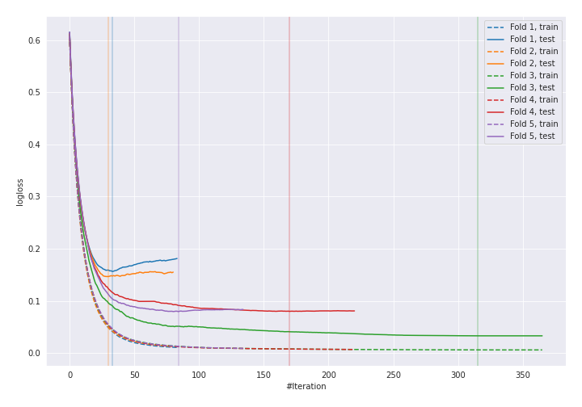

# Summary of 9_Xgboost_GoldenFeatures_RandomFeature

[<< Go back](../README.md)

## Extreme Gradient Boosting (Xgboost)
- **n_jobs**: -1
- **objective**: binary:logistic
- **eta**: 0.1
- **max_depth**: 8
- **min_child_weight**: 1
- **subsample**: 1.0
- **colsample_bytree**: 1.0
- **eval_metric**: logloss
- **explain_level**: 1

## Validation
 - **validation_type**: kfold
 - **k_folds**: 5
 - **shuffle**: True
 - **stratify**: True
 - **random_seed**: 1230

## Optimized metric
logloss

## Training time

13.7 seconds

## Metric details
|           |     score |     threshold |
|:----------|----------:|--------------:|
| logloss   | 0.0993906 | nan           |
| auc       | 0.992869  | nan           |
| f1        | 0.969555  |   0.409649    |
| accuracy  | 0.96934   |   0.485214    |
| precision | 1         |   0.976751    |
| recall    | 1         |   0.000145931 |
| mcc       | 0.938773  |   0.409649    |

## Confusion matrix (at threshold=0.485214)
|                     |   Predicted as negative |   Predicted as positive |
|:--------------------|------------------------:|------------------------:|
| Labeled as negative |                     206 |                       6 |
| Labeled as positive |                       7 |                     205 |

## Learning curves

## Permutation-based Importance

[<< Go back](../README.md)
