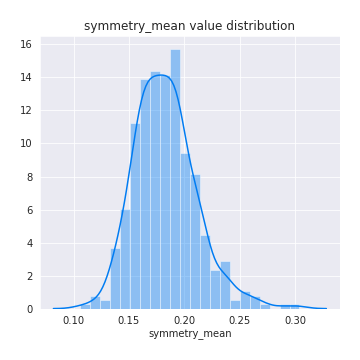

# Exploratory Data Analysis

[<< Go back](../README.md)
## Feature : target
- **Feature type** : discrete
- **Missing** : 0.0%
- **Unique** : 2
- **Count** :424.0
- **Mean** :0.5
- **Std** :0.5005906676601786
- **Min** :0.0
- **25%th Percentile** : 0.0
- **50%th Percentile** : 0.5
- **75%th Percentile** : 1.0
- **Max** :1.0

## Feature : radius_mean
- **Feature type** : continous
- **Missing** : 0.0%
- **Unique** : 357
- **Count** :424.0
- **Mean** :14.786962264150953
- **Std** :3.7236261379996143
- **Min** :7.691
- **25%th Percentile** : 12.045000000000002
- **50%th Percentile** : 13.885
- **75%th Percentile** : 17.3675
- **Max** :28.11

## Feature : texture_mean
- **Feature type** : continous
- **Missing** : 0.0%
- **Unique** : 383
- **Count** :424.0
- **Mean** :19.666179245283033
- **Std** :4.354846166159689
- **Min** :10.38
- **25%th Percentile** : 16.61
- **50%th Percentile** : 19.36
- **75%th Percentile** : 22.1325
- **Max** :39.28

## Feature : perimeter_mean
- **Feature type** : continous
- **Missing** : 0.0%
- **Unique** : 392
- **Count** :424.0
- **Mean** :96.57936320754717
- **Std** :25.702390618732075
- **Min** :47.92
- **25%th Percentile** : 77.82000000000001
- **50%th Percentile** : 90.255
- **75%th Percentile** : 114.25
- **Max** :188.5

## Feature : area_mean
- **Feature type** : continous
- **Missing** : 0.0%
- **Unique** : 406
- **Count** :424.0
- **Mean** :719.2499999999999
- **Std** :379.1735785824686
- **Min** :170.4
- **25%th Percentile** : 445.8
- **50%th Percentile** : 596.8499999999999
- **75%th Percentile** : 936.7750000000001
- **Max** :2501.0

## Feature : smoothness_mean
- **Feature type** : continous
- **Missing** : 0.0%
- **Unique** : 363
- **Count** :424.0
- **Mean** :0.09766898584905659
- **Std** :0.013818634835215065
- **Min** :0.05263
- **25%th Percentile** : 0.0874975
- **50%th Percentile** : 0.09733
- **75%th Percentile** : 0.10665
- **Max** :0.1447

## Feature : compactness_mean
- **Feature type** : continous
- **Missing** : 0.0%
- **Unique** : 402
- **Count** :424.0
- **Mean** :0.11191099056603777
- **Std** :0.05566469373460424
- **Min** :0.02344
- **25%th Percentile** : 0.06972
- **50%th Percentile** : 0.10350000000000001
- **75%th Percentile** : 0.14167500000000002
- **Max** :0.3454

## Feature : concavity_mean
- **Feature type** : continous
- **Missing** : 0.0%
- **Unique** : 406
- **Count** :424.0
- **Mean** :0.10227021863207554
- **Std** :0.08398511500567445
- **Min** :0.0
- **25%th Percentile** : 0.035285
- **50%th Percentile** : 0.08094499999999999
- **75%th Percentile** : 0.15255000000000002
- **Max** :0.4268

## Feature : concave points_mean
- **Feature type** : continous
- **Missing** : 0.0%
- **Unique** : 409
- **Count** :424.0
- **Mean** :0.05677395283018867
- **Std** :0.0410971960716647
- **Min** :0.0
- **25%th Percentile** : 0.02369
- **50%th Percentile** : 0.048235
- **75%th Percentile** : 0.08626
- **Max** :0.2012

## Feature : symmetry_mean
- **Feature type** : continous
- **Missing** : 0.0%
- **Unique** : 343
- **Count** :424.0
- **Mean** :0.1828981132075474
- **Std** :0.02803696135649077
- **Min** :0.106
- **25%th Percentile** : 0.16310000000000002
- **50%th Percentile** : 0.1807
- **75%th Percentile** : 0.19765
- **Max** :0.304

## Feature : fractal_dimension_mean
- **Feature type** : continous
- **Missing** : 0.0%
- **Unique** : 383
- **Count** :424.0
- **Mean** :0.06266900943396228
- **Std** :0.007017493808150351
- **Min** :0.04996
- **25%th Percentile** : 0.057475
- **50%th Percentile** : 0.061295
- **75%th Percentile** : 0.06639500000000001
- **Max** :0.09744

## Feature : radius_se
- **Feature type** : continous
- **Missing** : 0.0%
- **Unique** : 413
- **Count** :424.0
- **Mean** :0.44839976415094257
- **Std** :0.3016414095847975
- **Min** :0.1166
- **25%th Percentile** : 0.24995
- **50%th Percentile** : 0.3572
- **75%th Percentile** : 0.552475
- **Max** :2.873

## Feature : texture_se
- **Feature type** : continous
- **Missing** : 0.0%
- **Unique** : 393
- **Count** :424.0
- **Mean** :1.2237174528301888
- **Std** :0.5616151186877452
- **Min** :0.3602
- **25%th Percentile** : 0.8518749999999999
- **50%th Percentile** : 1.0775000000000001
- **75%th Percentile** : 1.46275
- **Max** :4.885

## Feature : perimeter_se
- **Feature type** : continous
- **Missing** : 0.0%
- **Unique** : 404
- **Count** :424.0
- **Mean** :3.160018160377363
- **Std** :2.2173853887296393
- **Min** :0.7714
- **25%th Percentile** : 1.7365000000000002
- **50%th Percentile** : 2.542
- **75%th Percentile** : 3.7760000000000002
- **Max** :21.98

## Feature : area_se
- **Feature type** : continous
- **Missing** : 0.0%
- **Unique** : 405
- **Count** :424.0
- **Mean** :47.032936320754715
- **Std** :50.75825124816013
- **Min** :8.205
- **25%th Percentile** : 19.1875
- **50%th Percentile** : 28.994999999999997
- **75%th Percentile** : 58.555
- **Max** :542.2

## Feature : smoothness_se
- **Feature type** : continous
- **Missing** : 0.0%
- **Unique** : 417
- **Count** :424.0
- **Mean** :0.007004950471698116
- **Std** :0.00296283820543473
- **Min** :0.001713
- **25%th Percentile** : 0.00516625
- **50%th Percentile** : 0.0063745
- **75%th Percentile** : 0.00804975
- **Max** :0.03113

## Feature : compactness_se
- **Feature type** : continous
- **Missing** : 0.0%
- **Unique** : 410
- **Count** :424.0
- **Mean** :0.026556339622641516
- **Std** :0.018395700432945274
- **Min** :0.003012
- **25%th Percentile** : 0.0137175
- **50%th Percentile** : 0.022155
- **75%th Percentile** : 0.033695
- **Max** :0.1354

## Feature : concavity_se
- **Feature type** : continous
- **Missing** : 0.0%
- **Unique** : 400
- **Count** :424.0
- **Mean** :0.03322872806603771
- **Std** :0.027319312367853087
- **Min** :0.0
- **25%th Percentile** : 0.0159925
- **50%th Percentile** : 0.027215000000000003
- **75%th Percentile** : 0.043905
- **Max** :0.3038

## Feature : concave points_se
- **Feature type** : continous
- **Missing** : 0.0%
- **Unique** : 387
- **Count** :424.0
- **Mean** :0.012347613207547174
- **Std** :0.006052482865977046
- **Min** :0.0
- **25%th Percentile** : 0.008404
- **50%th Percentile** : 0.011415
- **75%th Percentile** : 0.015575
- **Max** :0.0409

## Feature : symmetry_se
- **Feature type** : continous
- **Missing** : 0.0%
- **Unique** : 383
- **Count** :424.0
- **Mean** :0.02052155188679245
- **Std** :0.00883459589703842
- **Min** :0.007882
- **25%th Percentile** : 0.014914999999999998
- **50%th Percentile** : 0.018525
- **75%th Percentile** : 0.0231275
- **Max** :0.07895

## Feature : fractal_dimension_se
- **Feature type** : continous
- **Missing** : 0.0%
- **Unique** : 409
- **Count** :424.0
- **Mean** :0.0038268278301886818
- **Std** :0.0025201659691075433
- **Min** :0.0008948
- **25%th Percentile** : 0.0022642499999999998
- **50%th Percentile** : 0.003308
- **75%th Percentile** : 0.00457025
- **Max** :0.02286

## Feature : radius_worst
- **Feature type** : continous
- **Missing** : 0.0%
- **Unique** : 370
- **Count** :424.0
- **Mean** :17.24318396226415
- **Std** :5.129923552914727
- **Min** :8.678
- **25%th Percentile** : 13.307500000000001
- **50%th Percentile** : 15.955
- **75%th Percentile** : 20.585
- **Max** :36.04

## Feature : texture_worst
- **Feature type** : continous
- **Missing** : 0.0%
- **Unique** : 394
- **Count** :424.0
- **Mean** :26.31700471698113
- **Std** :6.319082790969481
- **Min** :12.49
- **25%th Percentile** : 21.6025
- **50%th Percentile** : 25.84
- **75%th Percentile** : 30.73
- **Max** :49.54

## Feature : perimeter_worst
- **Feature type** : continous
- **Missing** : 0.0%
- **Unique** : 391
- **Count** :424.0
- **Mean** :113.97672169811315
- **Std** :35.70807069652452
- **Min** :54.49
- **25%th Percentile** : 86.18
- **50%th Percentile** : 104.94999999999999
- **75%th Percentile** : 137.95000000000002
- **Max** :251.2

## Feature : area_worst
- **Feature type** : continous
- **Missing** : 0.0%
- **Unique** : 412
- **Count** :424.0
- **Mean** :989.6063679245291
- **Std** :616.2047780516086
- **Min** :223.6
- **25%th Percentile** : 544.1750000000001
- **50%th Percentile** : 775.5
- **75%th Percentile** : 1302.5
- **Max** :4254.0

## Feature : smoothness_worst
- **Feature type** : continous
- **Missing** : 0.0%
- **Unique** : 332
- **Count** :424.0
- **Mean** :0.13484162735849056
- **Std** :0.022923173806116904
- **Min** :0.07117
- **25%th Percentile** : 0.119
- **50%th Percentile** : 0.13574999999999998
- **75%th Percentile** : 0.1491
- **Max** :0.2226

## Feature : compactness_worst
- **Feature type** : continous
- **Missing** : 0.0%
- **Unique** : 404
- **Count** :424.0
- **Mean** :0.2753406132075473
- **Std** :0.16696926233482298
- **Min** :0.02729
- **25%th Percentile** : 0.1582
- **50%th Percentile** : 0.2358
- **75%th Percentile** : 0.36925
- **Max** :1.058

## Feature : concavity_worst
- **Feature type** : continous
- **Missing** : 0.0%
- **Unique** : 404
- **Count** :424.0
- **Mean** :0.3029602452830188
- **Std** :0.21678606049313576
- **Min** :0.0
- **25%th Percentile** : 0.1377
- **50%th Percentile** : 0.26765
- **75%th Percentile** : 0.41655
- **Max** :1.252

## Feature : concave points_worst
- **Feature type** : continous
- **Missing** : 0.0%
- **Unique** : 388
- **Count** :424.0
- **Mean** :0.12754132547169816
- **Std** :0.06826757445129832
- **Min** :0.0
- **25%th Percentile** : 0.07403499999999999
- **50%th Percentile** : 0.11845
- **75%th Percentile** : 0.182
- **Max** :0.291

## Feature : symmetry_worst
- **Feature type** : continous
- **Missing** : 0.0%
- **Unique** : 388
- **Count** :424.0
- **Mean** :0.2958601415094339
- **Std** :0.06721453104023452
- **Min** :0.1565
- **25%th Percentile** : 0.251
- **50%th Percentile** : 0.2861
- **75%th Percentile** : 0.322325
- **Max** :0.6638

## Feature : fractal_dimension_worst
- **Feature type** : continous
- **Missing** : 0.0%
- **Unique** : 403
- **Count** :424.0
- **Mean** :0.0851223113207548
- **Std** :0.018987215241728066
- **Min** :0.05504
- **25%th Percentile** : 0.071755
- **50%th Percentile** : 0.081145
- **75%th Percentile** : 0.0937425
- **Max** :0.2075

[<< Go back](../README.md)
