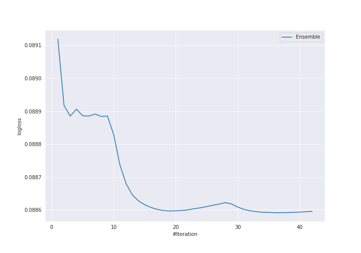

# Summary of Ensemble

[<< Go back](../README.md)

## Ensemble structure
| Model                                      |   Weight |
|:-------------------------------------------|---------:|
| 17_NeuralNetwork                           |        2 |
| 30_Xgboost_GoldenFeatures_SelectedFeatures |       16 |
| 4_Default_Xgboost                          |        1 |
| 9_Xgboost_GoldenFeatures_SelectedFeatures  |       17 |

## Metric details
|           |     score |     threshold |
|:----------|----------:|--------------:|
| logloss   | 0.0885919 | nan           |
| auc       | 0.994927  | nan           |
| f1        | 0.971698  |   0.5087      |
| accuracy  | 0.971698  |   0.5087      |
| precision | 1         |   0.975886    |
| recall    | 1         |   0.000172241 |
| mcc       | 0.943438  |   0.557672    |

## Confusion matrix (at threshold=0.5087)
|                     |   Predicted as negative |   Predicted as positive |
|:--------------------|------------------------:|------------------------:|
| Labeled as negative |                     206 |                       6 |
| Labeled as positive |                       6 |                     206 |

## Learning curves

[<< Go back](../README.md)
