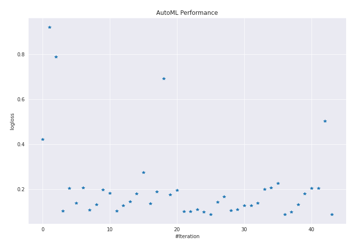
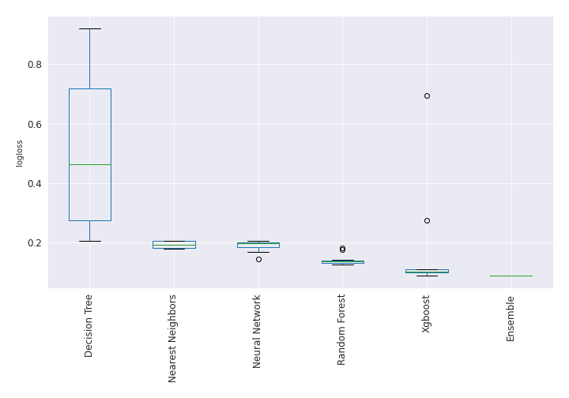

# AutoML Leaderboard

| Best model   | name                                                                                               | model_type        | metric_type   |   metric_value |   train_time |   single_prediction_time |
|:-------------|:---------------------------------------------------------------------------------------------------|:------------------|:--------------|---------------:|-------------:|-------------------------:|
|              | [1_DecisionTree](1_DecisionTree/README.md)                                                         | Decision Tree     | logloss       |      0.42201   |        70.41 |                   0.0546 |
|              | [2_DecisionTree](2_DecisionTree/README.md)                                                         | Decision Tree     | logloss       |      0.920591  |        40.99 |                   0.0778 |
|              | [3_DecisionTree](3_DecisionTree/README.md)                                                         | Decision Tree     | logloss       |      0.788025  |        42.38 |                   0.0709 |
|              | [4_Default_Xgboost](4_Default_Xgboost/README.md)                                                   | Xgboost           | logloss       |      0.103174  |        38.38 |                   0.0622 |
|              | [5_Default_NeuralNetwork](5_Default_NeuralNetwork/README.md)                                       | Neural Network    | logloss       |      0.205855  |         8.74 |                   0.0923 |
|              | [6_Default_RandomForest](6_Default_RandomForest/README.md)                                         | Random Forest     | logloss       |      0.139028  |        71.54 |                   0.5689 |
|              | [7_Default_NearestNeighbors](7_Default_NearestNeighbors/README.md)                                 | Nearest Neighbors | logloss       |      0.20686   |        43.84 |                   0.6114 |
|              | [8_Xgboost](8_Xgboost/README.md)                                                                   | Xgboost           | logloss       |      0.109154  |        38.88 |                   0.0531 |
|              | [12_RandomForest](12_RandomForest/README.md)                                                       | Random Forest     | logloss       |      0.132294  |        70.2  |                   0.5652 |
|              | [16_NeuralNetwork](16_NeuralNetwork/README.md)                                                     | Neural Network    | logloss       |      0.198462  |         5.91 |                   0.0887 |
|              | [20_NearestNeighbors](20_NearestNeighbors/README.md)                                               | Nearest Neighbors | logloss       |      0.183506  |        43.59 |                   0.6062 |
|              | [9_Xgboost](9_Xgboost/README.md)                                                                   | Xgboost           | logloss       |      0.10399   |        36.51 |                   0.0538 |
|              | [13_RandomForest](13_RandomForest/README.md)                                                       | Random Forest     | logloss       |      0.129132  |        72.22 |                   0.5716 |
|              | [17_NeuralNetwork](17_NeuralNetwork/README.md)                                                     | Neural Network    | logloss       |      0.145634  |         6.75 |                   0.0851 |
|              | [21_NearestNeighbors](21_NearestNeighbors/README.md)                                               | Nearest Neighbors | logloss       |      0.180764  |        43.67 |                   0.6154 |
|              | [10_Xgboost](10_Xgboost/README.md)                                                                 | Xgboost           | logloss       |      0.274797  |        31.03 |                   0.0543 |
|              | [14_RandomForest](14_RandomForest/README.md)                                                       | Random Forest     | logloss       |      0.13626   |        74.89 |                   0.5713 |
|              | [18_NeuralNetwork](18_NeuralNetwork/README.md)                                                     | Neural Network    | logloss       |      0.190606  |         6.58 |                   0.0812 |
|              | [11_Xgboost](11_Xgboost/README.md)                                                                 | Xgboost           | logloss       |      0.693092  |        30.39 |                   0.0538 |
|              | [15_RandomForest](15_RandomForest/README.md)                                                       | Random Forest     | logloss       |      0.176479  |        69.74 |                   0.5733 |
|              | [19_NeuralNetwork](19_NeuralNetwork/README.md)                                                     | Neural Network    | logloss       |      0.19675   |         5.86 |                   0.0822 |
|              | [4_Default_Xgboost_GoldenFeatures](4_Default_Xgboost_GoldenFeatures/README.md)                     | Xgboost           | logloss       |      0.102272  |        49.11 |                   0.0995 |
|              | [9_Xgboost_GoldenFeatures](9_Xgboost_GoldenFeatures/README.md)                                     | Xgboost           | logloss       |      0.102036  |        50.87 |                   0.1024 |
|              | [8_Xgboost_GoldenFeatures](8_Xgboost_GoldenFeatures/README.md)                                     | Xgboost           | logloss       |      0.110021  |        38.01 |                   0.1026 |
|              | [9_Xgboost_GoldenFeatures_RandomFeature](9_Xgboost_GoldenFeatures_RandomFeature/README.md)         | Xgboost           | logloss       |      0.0993906 |        14.76 |                   0.1014 |
|              | [9_Xgboost_GoldenFeatures_SelectedFeatures](9_Xgboost_GoldenFeatures_SelectedFeatures/README.md)   | Xgboost           | logloss       |      0.0891191 |        28.17 |                   0.0982 |
|              | [13_RandomForest_SelectedFeatures](13_RandomForest_SelectedFeatures/README.md)                     | Random Forest     | logloss       |      0.143235  |        45    |                   0.573  |
|              | [17_NeuralNetwork_SelectedFeatures](17_NeuralNetwork_SelectedFeatures/README.md)                   | Neural Network    | logloss       |      0.168263  |         4.18 |                   0.0782 |
|              | [22_Xgboost_GoldenFeatures_SelectedFeatures](22_Xgboost_GoldenFeatures_SelectedFeatures/README.md) | Xgboost           | logloss       |      0.106396  |        35    |                   0.0948 |
|              | [23_Xgboost_GoldenFeatures](23_Xgboost_GoldenFeatures/README.md)                                   | Xgboost           | logloss       |      0.11077   |        37.84 |                   0.1024 |
|              | [24_RandomForest](24_RandomForest/README.md)                                                       | Random Forest     | logloss       |      0.129132  |        68.06 |                   0.5764 |
|              | [25_RandomForest](25_RandomForest/README.md)                                                       | Random Forest     | logloss       |      0.127291  |        70.01 |                   0.5658 |
|              | [26_RandomForest](26_RandomForest/README.md)                                                       | Random Forest     | logloss       |      0.138823  |        69.44 |                   0.5764 |
|              | [27_NeuralNetwork](27_NeuralNetwork/README.md)                                                     | Neural Network    | logloss       |      0.200491  |         6.01 |                   0.0766 |
|              | [28_NeuralNetwork_SelectedFeatures](28_NeuralNetwork_SelectedFeatures/README.md)                   | Neural Network    | logloss       |      0.207272  |         3.79 |                   0.0747 |
|              | [29_DecisionTree](29_DecisionTree/README.md)                                                       | Decision Tree     | logloss       |      0.226607  |        27.97 |                   0.0551 |
|              | [30_Xgboost_GoldenFeatures_SelectedFeatures](30_Xgboost_GoldenFeatures_SelectedFeatures/README.md) | Xgboost           | logloss       |      0.0896184 |        38.72 |                   0.0957 |
|              | [31_Xgboost_GoldenFeatures](31_Xgboost_GoldenFeatures/README.md)                                   | Xgboost           | logloss       |      0.100067  |        37.78 |                   0.0974 |
|              | [32_RandomForest](32_RandomForest/README.md)                                                       | Random Forest     | logloss       |      0.133579  |        70.84 |                   0.569  |
|              | [33_RandomForest](33_RandomForest/README.md)                                                       | Random Forest     | logloss       |      0.181781  |        70.98 |                   0.5774 |
|              | [34_NearestNeighbors](34_NearestNeighbors/README.md)                                               | Nearest Neighbors | logloss       |      0.204553  |        43.9  |                   0.5952 |
|              | [35_DecisionTree](35_DecisionTree/README.md)                                                       | Decision Tree     | logloss       |      0.205083  |        27.65 |                   0.0612 |
|              | [36_DecisionTree](36_DecisionTree/README.md)                                                       | Decision Tree     | logloss       |      0.50384   |        33.61 |                   0.0547 |
| **the best** | [Ensemble](Ensemble/README.md)                                                                     | Ensemble          | logloss       |      0.0885919 |         6.93 |                   0.3394 |

### AutoML Performance

### AutoML Performance Boxplot
